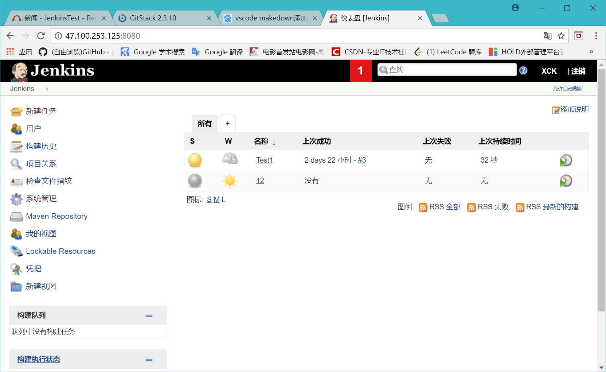
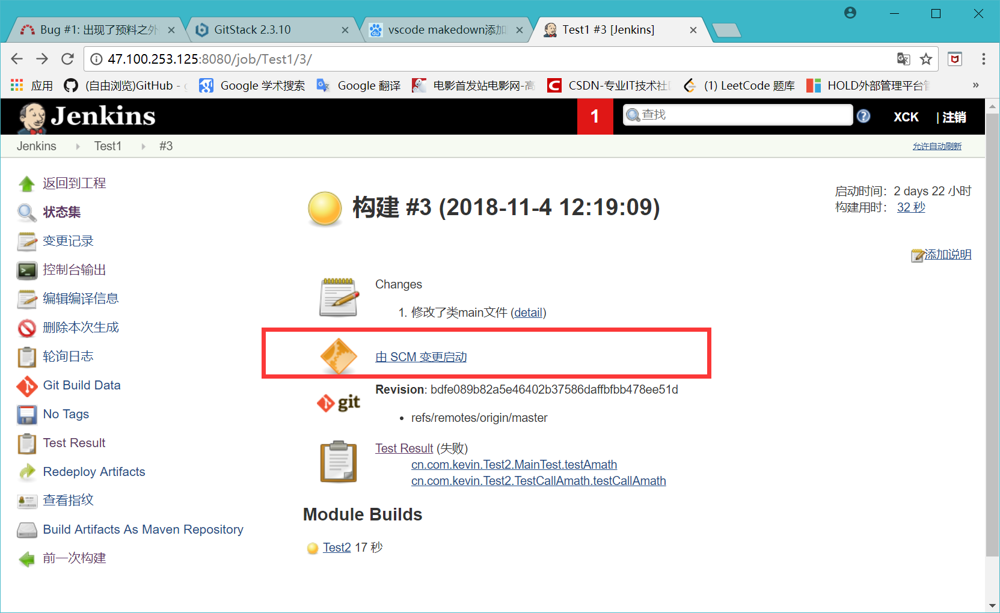

## 持续集成与测试

### 配置基本开发环境
1. 安装和配置Git代码仓库  

2. 安装和配置Jenkins持续集成工具  

3. 配置maven，git，JDK1.8  
添加java和maven的环境变量，在jenkins中配置maven，git以及添加JDK  

 

    
4. 安装配置缺陷管理工具Redmine
 
#
### 在持续集成环境（Jenkins）中配置项目并管理
1. 构建一个maven项目，命名并添加相关描述
2. 勾选git进行源码管理，并添加git仓库的URL地址以及访问用户  

3. 构建触发器，可以选择定时构建和轮询SCM
4. 添加maven项目的pom.xml文件
5. 查看项目构建情况，状态以及测试结构趋势  

#

### 冒烟测试
1. 创建项目之后，立即构建
2. 可以看到项目的构建历史记录以及每一次构建的具体信息，例如状态集，变更记录和每次构建的控制台输出

3. 如出现构建失败，查看控制台输出得到提示信息

#
### 使用Redmine进行缺陷管理与登记
1. 在构建项目并测试之后，得到有关的代码缺陷信息
2. 在项目中创建一个issue，并添加代码缺陷信息，指定人员作为观察者（watcher）进行处理

3. watcher获取issue进行处理，并根据自己的处理进度在issue的status中进行修改，报告进度

#
## 项目的开发测试（模拟他人接手）
1. 账号密码  
    Gitstack 地址: http://47.100.253.125/gitstack 账号：** 密码：** 
    Jenkins 地址：http://47.100.253.125:8080/ 账号：** 密码：** 
    Redmine 地址：http://47.100.253.125:81/redmine 账号：** 密码：** 管理员：** 密码：**

2. 使用Git仓库管理项目代码  
    项目人员使用git获取代码并针对bug进行修改，提交本地代码到云上仓库。  

3. 使用Jenkins构建项目新代码  
    Jenkins会自动构建项目代码  
    
    在控制台输出相关信息。若出现错误则根据控制台信息记录bug信息，以便之后的缺陷管理，Jenkins还可以打包项目的所有代码，生成新的版本。

4. 使用Redmine进行缺陷管理  
    根据Jenkins的bug记录，在Redmine中新建issue并指定watcher进行跟踪修改，并可以实时查看issue的状态。watcher获取有缺陷版本代码进行修正，在解决代码bug缺陷之后，Git新版本的代码到云仓库中，之后Jenkins自动构建新版本代码，生成经过修正的版本代码。

